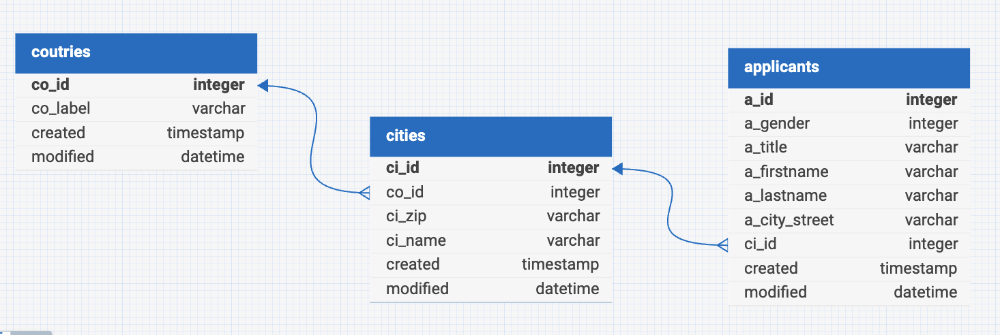

<!--toc:start-->
- [Database](#database)
- [Relations](#relations)
- [Tables](#tables)
  - [`countries`](#countries)
    - [`countries` - Columns](#countries-columns)
    - [`countries` - Keys/Indexes](#countries-keysindexes)
  - [`cities`](#cities)
    - [`cities` - Columns](#cities-columns)
    - [`cities` - Keys/Indexes](#cities-keysindexes)
  - [`applicants`](#applicants)
    - [`applicants` - Columns](#applicants-columns)
    - [`applicants` - Keys/Indexes](#applicants-keysindexes)
<!--toc:end-->

# Database

# Relations

# Tables

## `countries`
A predefined list of Countries, an Applicant can live in.

### `countries` - Columns

| Column | Type | Default | Info |
| - | - | - | - |
| co_id | INT UNSIGNED| AUTO_INCREMENT | Primary Key |
| co_label | VARCHAR(256) | | |
| created | TIMESTAMP | CURRENT_TIMESTAMP() | |
| modified | DATETIME | CURRENT_TIMESTAMP() | ON DUPLICATE KEY UPDATE |

### `countries` - Keys/Indexes

| Column | Key | Reference Table | Reference Column | On Delete |
| - | - | - | - | - |  
| co_id | Primary | | | | 

## `cities`
A List of Cities (and Villages), that an Applicant can come from.
Ideally, you would fill this from a 3rd Party source, for the sake of this demo, 
the data Is filled in on the Fly, if an Applicant is registered.

### `cities` - Columns
| Column | Type | Default | Info |
| - | - | - | - |
| ci_id | INT UNSIGNED| AUTO_INCREMENT | Primary Key |
| co_id | INT UNSIGNED | | Foreign Key |
| ci_zip | VARCHAR(10) | | UNIQUE KEY NOT NULL |
| ci_name | VARCHAR(256) | | NOT NULL |
| created | TIMESTAMP | CURRENT_TIMESTAMP() | |
| modified | DATETIME | CURRENT_TIMESTAMP() | ON DUPLICATE KEY UPDATE |

### `cities` - Keys/Indexes
| Column | Key | Reference Table | Reference Column | On Delete |
| - | - | - | - | - |  
| ci_id | PRIMARY | | | | 
| co_id | FOREIGN | [`countries`](#countries) | co_id | RESTRICT | 
| ci_zip | UNIQUE | | | | 

## `applicants`
A list of People applying for a Job

### `applicants` - Columns
| Column | Type | Default | Info |
| - | - | - | - |
| a_id | INT UNSIGNED| AUTO_INCREMENT | Primary Key |
| a_gender | ENUM('male', 'female', 'diverse', 'no_comment') | 'no_comment' | |
| a_title | VARCHAR(64) | | |
| a_firstname | VARCHAR(512) | | NOT NULL |
| a_lastname | VARCHAR(512) | | NOT NULL |
| a_city_ctreet | VARCHAR(512) | | NOT NULL |
| ci_id | INT UNSIGNED | | NOT NULL Foreign Key |
| created | TIMESTAMP | CURRENT_TIMESTAMP() | |
| modified | DATETIME | CURRENT_TIMESTAMP() | ON DUPLICATE KEY UPDATE |

### `applicants` - Keys/Indexes
| Column | Key | Reference Table | Reference Column | On Delete |
| - | - | - | - | - |  
| a_id | PRIMARY | | | | 
| ci_id | FOREIGN | [`cities`](#cities) | ci_id | RESTRICT | 
| a_firstname - a_lastname - cid | UNIQUE | | | | 

